```mermaid
graph TD
    A[Start: Process Contact] --> B{Search by Email + Account + Product}
    B -->|Found| C[✅ Use Existing Contact]
    B -->|Not Found| D{Search by Email + Product only}
    D -->|Found| E[✅ Use Existing Contact from Fallback]
    D -->|Not Found| F{enableCreateContact?}
    F -->|true| G[Create New Contact]
    F -->|false| H[⚠️ Skip Contact with Warning]
    G --> I{Creation Success?}
    I -->|Yes| C
    I -->|No| H
```

# CRM Function App - Comprehensive API Guide

> **Complete guide to the SM-CRM-FN API for creating appointments in Microsoft Dynamics 365 CRM**

## Table of Contents

- [1. Overview](#1-overview)
  - [What This Service Does](#what-this-service-does)
  - [Architecture Overview](#architecture-overview)
  - [Dynamics 365 Integration](#dynamics-365-integration)
- [2. Key Concepts](#2-key-concepts)
  - [Selfcare ID vs Account ID Mapping](#selfcare-id-vs-account-id-mapping)
  - [Contact Verification and Creation Logic](#contact-verification-and-creation-logic)
  - [Product ID Mapping](#product-id-mapping)
  - [Navigation Properties vs Entity References](#navigation-properties-vs-entity-references)
- [3. Complete Flow Diagram](#3-complete-flow-diagram)
- [4. API Parameters Reference](#4-api-parameters-reference)
  - [Required Parameters](#required-parameters)
  - [Optional Parameters](#optional-parameters)
  - [Control Flags](#control-flags)
- [5. Complete Examples](#5-complete-examples)
  - [Minimal Request](#minimal-request)
  - [Full Request with All Parameters](#full-request-with-all-parameters)
  - [Dry-Run Mode Example](#dry-run-mode-example)
  - [Error Scenarios](#error-scenarios)
- [6. Troubleshooting](#6-troubleshooting)
  - [Common Errors and Solutions](#common-errors-and-solutions)
  - [Debugging with Application Insights](#debugging-with-application-insights)
  - [Log Markers](#log-markers)
- [7. Environment-Specific Notes](#7-environment-specific-notes)
  - [DEV vs UAT vs PROD Differences](#dev-vs-uat-vs-prod-differences)
  - [When to Use enableGrantAccess](#when-to-use-enablegrantaccess)
  - [GrantAccess API Availability](#grantaccess-api-availability)

---

## 1. Overview

### What This Service Does

The **SM-CRM-FN (Service Management CRM Function)** is an Azure Functions application that provides a REST API for creating and managing appointments in Microsoft Dynamics 365 CRM. It acts as an integration layer between PagoPA's Selfcare platform and Dynamics 365.

**Core Capabilities:**

- ✅ Verify existence of Institutions (Accounts) in Dynamics CRM
- ✅ Verify and optionally create Contacts for meeting participants
- ✅ Create appointments with multiple participants
- ✅ Optionally grant visibility to Sales team via GrantAccess
- ✅ Dry-run mode for testing without making changes

### Architecture Overview

```
┌─────────────────────┐
│  Selfcare Frontend  │
│   or CRM Client     │
└──────────┬──────────┘
           │ HTTP Request
           │ (institutionIdSelfcare, productIdSelfcare, partecipanti, ...)
           ▼
┌─────────────────────────────────────────────────────────┐
│             SM-CRM-FN (Azure Function App)              │
│                                                         │
│  ┌───────────────────────────────────────────────────┐ │
│  │         Meeting Orchestrator                      │ │
│  │  (4-step flow: Account → Contacts → Appointment  │ │
│  │                → GrantAccess)                     │ │
│  └───────────────────────────────────────────────────┘ │
│                                                         │
│  Services:                                              │
│  • accounts.ts    - Account verification               │
│  • contacts.ts    - Contact verification/creation      │
│  • appointments.ts - Appointment creation              │
│  • grantAccess.ts - Sales team visibility             │
│  • auth.ts        - Azure AD authentication           │
│  • httpClient.ts  - HTTP client with dry-run support  │
└────────────────────┬────────────────────────────────────┘
                     │ OData API Calls
                     │ (Authorization: Bearer token)
                     ▼
┌─────────────────────────────────────────────────────────┐
│       Microsoft Dynamics 365 CRM (Dataverse)            │
│                                                         │
│  Entities:                                              │
│  • accounts   - Institutions/Organizations             │
│  • contacts   - People associated with institutions    │
│  • appointments - Scheduled meetings                   │
│  • teams      - Sales team for visibility              │
└─────────────────────────────────────────────────────────┘
```

### Dynamics 365 Integration

**Authentication**:

- **Production**: Managed Identity (System Assigned)
- **Development**: Azure AD Service Principal

**API Standard**: OData v4.0 Web API

**Required Headers**:

```http
Authorization: Bearer {token}
Content-Type: application/json; charset=utf-8
OData-MaxVersion: 4.0
OData-Version: 4.0
Accept: application/json
Prefer: return=representation
```

---

## 2. Key Concepts

### Selfcare ID vs Account ID Mapping

**⚠️ IMPORTANT**: This is one of the most critical concepts to understand!

#### The Problem

Selfcare and Dynamics 365 use different ID systems:

- **Selfcare**: Uses UUIDs to identify institutions (`institutionIdSelfcare`)
  - Example: `f1806fd6-5bd0-42bb-a2c8-04603190decd`
- **Dynamics 365**: Has its own internal GUIDs for Accounts (`accountid`)
  - Example: `29ae898f-69c8-f011-bbd2-7ced8d472a9b`

#### The Solution: Mapping via `pgp_identificativoselfcare`

The connection between these two systems happens through a custom field in Dynamics:

```
Selfcare Institution ID  →  pgp_identificativoselfcare  →  Dynamics Account ID
     (UUID)                     (stored in CRM)               (GUID)
```

#### Example Flow

**Request Parameter:**

```json
{
  "institutionIdSelfcare": "f1806fd6-5bd0-42bb-a2c8-04603190decd"
}
```

**What Happens Behind the Scenes:**

1. **API Query to Dynamics**:

   ```
   GET /api/data/v9.2/accounts?$filter=pgp_identificativoselfcare eq 'f1806fd6-5bd0-42bb-a2c8-04603190decd'
   ```

2. **Response from Dynamics**:

   ```json
   {
     "value": [
       {
         "accountid": "29ae898f-69c8-f011-bbd2-7ced8d472a9b",
         "name": "Comune di Roma",
         "pgp_identificativoselfcare": "f1806fd6-5bd0-42bb-a2c8-04603190decd",
         "emailaddress1": "info@comune.roma.it"
       }
     ]
   }
   ```

3. **Extracted `accountid`** is then used for all subsequent operations (contacts, appointments, etc.)

#### Key Takeaways

- ✅ Always use `institutionIdSelfcare` in API requests (the Selfcare UUID)
- ✅ The Function App automatically handles the mapping
- ✅ The `accountid` is used internally but returned in responses
- ⚠️ If `pgp_identificativoselfcare` is not set in CRM, the institution cannot be found

---

### Contact Verification and Creation Logic

The contact verification/creation process follows a **multi-stage search strategy**:

#### Stage 1: Exact Match (Email + Account + Product)

```
GET /api/data/v9.2/contacts?$filter=
  emailaddress1 eq 'mario.rossi@ente.it' and
  _parentcustomerid_value eq '{accountId}' and
  _pgp_prodottoid_value eq '{productGuid}'
```

**Goal**: Find a contact with matching email, belonging to the specific institution, for the specific product.

#### Stage 2: Fallback (Email + Product Only)

If Stage 1 fails:

```
GET /api/data/v9.2/contacts?$filter=
  emailaddress1 eq 'mario.rossi@ente.it' and
  _pgp_prodottoid_value eq '{productGuid}'
```

**Goal**: Find a contact with matching email for the product, regardless of institution.

#### Stage 3: Create Contact (if `enableCreateContact: true`)

If no contact is found and creation is enabled:

```json
POST /api/data/v9.2/contacts
{
  "firstname": "Mario",
  "lastname": "Rossi",
  "emailaddress1": "mario.rossi@ente.it",
  "pgp_tipologiareferente": 100000002,
  "parentcustomerid_account@odata.bind": "/accounts({accountId})",
  "pgp_ProdottoId@odata.bind": "/pgp_prodottoes({productGuid})"
}
```

#### Decision Tree



#### Important Notes

- **Default Behavior**: `enableCreateContact: false` (contacts must exist)
- **Contact Requirements**: When creating contacts, `nome` and `cognome` are REQUIRED
- **Product Association**: Contacts are always linked to a specific product
- **Warnings vs Errors**: Missing contacts generate warnings, not errors (appointment can still be created with remaining contacts)

---

### Product ID Mapping

Products use string identifiers in Selfcare that must be mapped to Dynamics GUIDs:

#### Available Products

| Selfcare ID           | Product Name     | Environment Dependency |
| --------------------- | ---------------- | ---------------------- |
| `prod-pn`             | SEND             | ✅ All environments    |
| `prod-io`             | IO               | ✅ All environments    |
| `prod-pagopa`         | pagoPA           | ✅ All environments    |
| `prod-idpay`          | IDPAY            | ✅ All environments    |
| `prod-idpay-merchant` | IDPAY Esercenti  | ✅ All environments    |
| `prod-checkiban`      | CheckIBAN        | ✅ All environments    |
| `prod-interop`        | Interoperabilità | ✅ All environments    |
| `prod-io-premium`     | IO Premium       | ✅ All environments    |
| `prod-io-sign`        | Firma con IO     | ✅ All environments    |
| `prod-rtp`            | Request To Pay   | ⚠️ DEV/UAT only        |

#### Example Mapping (UAT Environment)

```typescript
{
  "prod-pagopa": "c00c3e9a-a205-f011-bae3-000d3adf9667",
  "prod-io": "26a975ef-a205-f011-bae4-000d3ab7023d",
  "prod-pn": "617cbe1b-bb58-f011-877b-000d3a662132"
  // ... etc
}
```

**⚠️ Note**: Product GUIDs are **different** in each environment (DEV/UAT/PROD)!

---

### Navigation Properties vs Entity References

Dynamics 365 uses two approaches for linking entities:

#### Navigation Properties (Read)

Used when querying data:

```json
{
  "contactid": "abc-123",
  "_parentcustomerid_value": "xyz-789", // ← Account GUID (read-only)
  "_pgp_prodottoid_value": "def-456" // ← Product GUID (read-only)
}
```

#### Entity References (Write)

Used when creating/updating data:

```json
{
  "firstname": "Mario",
  "parentcustomerid_account@odata.bind": "/accounts(xyz-789)", // ← Reference
  "pgp_ProdottoId@odata.bind": "/pgp_prodottoes(def-456)" // ← Reference
}
```

**Key Points**:

- `@odata.bind` suffix indicates a relationship
- Format: `/{entitySetName}({guid})`
- Use this for POST/PATCH operations

---

## 3. Complete Flow Diagram

```mermaid
flowchart TD
    START([POST /api/v1/meetings]) --> VALIDATE{Validate Request}
    VALIDATE -->|Invalid| ERROR_400[❌ 400 Bad Request]
    VALIDATE -->|Valid| DRYRUN{dryRun mode?}

    DRYRUN -->|true| DRY_MODE[🧪 Enable Dry-Run Mode]
    DRYRUN -->|false| STEP1
    DRY_MODE --> STEP1

    STEP1[📋 STEP 1: Verify Account]
    STEP1 --> SEARCH_ACCOUNT{Search by Selfcare ID}
    SEARCH_ACCOUNT -->|Found| STEP1_SUCCESS[✅ Account Found]
    SEARCH_ACCOUNT -->|Not Found| FALLBACK{enableFallback?}
    FALLBACK -->|true| SEARCH_NAME[Search by Name]
    FALLBACK -->|false| ERROR_404A[❌ 404 Account Not Found]
    SEARCH_NAME -->|Found| STEP1_SUCCESS
    SEARCH_NAME -->|Not Found| ERROR_404A
    SEARCH_NAME -->|Multiple| ERROR_409[❌ 409 Ambiguous]

    STEP1_SUCCESS --> STEP2[📋 STEP 2: Verify/Create Contacts]

    STEP2 --> LOOP_START{For Each Participant}
    LOOP_START --> SEARCH_CONTACT[Search Contact by Email + Account + Product]
    SEARCH_CONTACT -->|Found| ADD_CONTACT[✅ Add to List]
    SEARCH_CONTACT -->|Not Found| FALLBACK_CONTACT[Search by Email + Product]
    FALLBACK_CONTACT -->|Found| ADD_CONTACT
    FALLBACK_CONTACT -->|Not Found| CHECK_CREATE{enableCreateContact?}
    CHECK_CREATE -->|true| CREATE_CONTACT[Create New Contact]
    CHECK_CREATE -->|false| WARN_SKIP[⚠️ Warning: Skip Contact]
    CREATE_CONTACT -->|Success| ADD_CONTACT
    CREATE_CONTACT -->|Failed| WARN_SKIP
    ADD_CONTACT --> LOOP_END{More Participants?}
    WARN_SKIP --> LOOP_END
    LOOP_END -->|Yes| LOOP_START
    LOOP_END -->|No| CHECK_CONTACTS{Any Valid Contacts?}

    CHECK_CONTACTS -->|No| ERROR_400B[❌ 400 No Valid Contacts]
    CHECK_CONTACTS -->|Yes| STEP3[📋 STEP 3: Create Appointment]

    STEP3 --> CREATE_APT[POST /appointments with activity_parties]
    CREATE_APT -->|Success| STEP3_SUCCESS[✅ Appointment Created]
    CREATE_APT -->|Failed| ERROR_500[❌ 500 Creation Failed]

    STEP3_SUCCESS --> CHECK_GRANT{enableGrantAccess?}
    CHECK_GRANT -->|false| SKIP_GRANT[ℹ️ STEP 4 SKIPPED]
    CHECK_GRANT -->|true| STEP4[📋 STEP 4: Grant Access]

    STEP4 --> GRANT_API[POST /appointments/Microsoft.Dynamics.CRM.GrantAccess]
    GRANT_API -->|Success| STEP4_SUCCESS[✅ Access Granted]
    GRANT_API -->|Failed| WARN_GRANT[⚠️ Warning: GrantAccess Failed]

    STEP4_SUCCESS --> SUCCESS_201
    WARN_GRANT --> SUCCESS_207[✅ 207 Success with Warnings]
    SKIP_GRANT --> SUCCESS_201[✅ 201 Created]

    SUCCESS_201 --> DISABLE_DRY{dryRun was enabled?}
    SUCCESS_207 --> DISABLE_DRY
    DISABLE_DRY -->|true| DISABLE[Disable Dry-Run Mode]
    DISABLE_DRY -->|false| RESPONSE
    DISABLE --> RESPONSE

    RESPONSE([Return Response with Steps])
```



### Step-by-Step Explanation

#### STEP 1: Account Verification

- **Goal**: Find the institution (Account) in Dynamics
- **Input**: `institutionIdSelfcare` or `nomeEnte`
- **Query**: Search by `pgp_identificativoselfcare` field
- **Fallback**: Search by name (if `enableFallback: true`)
- **Output**: `accountId` (Dynamics GUID)
- **Errors**: 404 (not found), 409 (ambiguous)

#### STEP 2: Contact Verification/Creation

- **Goal**: Ensure all participants exist as Contacts in Dynamics
- **Input**: Array of `partecipanti` with email, nome, cognome
- **Process**: For each participant:
  1. Search by email + account + product
  2. Fallback: Search by email + product only
  3. If not found and `enableCreateContact: true`: Create contact
  4. If not found and `enableCreateContact: false`: Skip with warning
- **Output**: List of `contactIds`
- **Errors**: None (warnings only)

#### STEP 3: Appointment Creation

- **Goal**: Create the appointment with all participants
- **Input**: Subject, dates, location, contacts, account
- **Process**: POST to `/appointments` with `appointment_activity_parties`
- **Output**: `activityId` (appointment GUID)
- **Errors**: 500 (creation failed)

#### STEP 4: Grant Access (Optional)

- **Goal**: Make appointment visible to Sales team
- **Input**: `activityId` from STEP 3
- **Process**: POST to GrantAccess custom action
- **Output**: Success or warning
- **Errors**: None (non-blocking warning)
- **Condition**: Only runs if `enableGrantAccess: true`

---

## 4. API Parameters Reference

### Required Parameters

#### `institutionIdSelfcare` (string, UUID)

**Description**: The Selfcare UUID of the institution where the appointment will be created.

**Example**: `"f1806fd6-5bd0-42bb-a2c8-04603190decd"`

**How it works**:

- This UUID is searched in the `pgp_identificativoselfcare` field in Dynamics
- Must match an existing Account in CRM
- Alternative: Use `nomeEnte` if Selfcare ID is not available

**When to use**: Always prefer this over `nomeEnte` when available

---

#### `productIdSelfcare` (string, enum)

**Description**: The Selfcare product identifier for which the appointment is being created.

**Example**: `"prod-pagopa"`

**Valid values**:

```
prod-pn | prod-io | prod-pagopa | prod-idpay | prod-idpay-merchant |
prod-checkiban | prod-interop | prod-io-premium | prod-io-sign | prod-rtp
```

**How it works**:

- Mapped to a Dynamics product GUID based on environment
- Used to associate contacts with the correct product
- Required for contact search and creation

**⚠️ Note**: `prod-rtp` is not available in PROD

---

#### `partecipanti` (array)

**Description**: Array of meeting participants. At least one participant is required.

**Structure**:

```typescript
{
  email: string;          // Required - used for contact search
  nome?: string;          // Required IF contact doesn't exist and will be created
  cognome?: string;       // Required IF contact doesn't exist and will be created
  tipologiaReferente?: string;  // Optional - default: "TECNICO"
}
```

**Example**:

```json
[
  {
    "email": "mario.rossi@ente.it",
    "nome": "Mario",
    "cognome": "Rossi",
    "tipologiaReferente": "TECNICO"
  },
  {
    "email": "laura.bianchi@ente.it",
    "nome": "Laura",
    "cognome": "Bianchi",
    "tipologiaReferente": "BUSINESS"
  }
]
```

**Valid `tipologiaReferente` values**:

```
APICALE | DIRETTO | TECNICO | BUSINESS | ACCOUNT |
RESPONSABILE_DI_TRASFORMAZIONE_DIGITALE | REFERENTE_CONTRATTUALE |
RESPONSABILE_PROTEZIONE_DATI | REFERENTE_BUSINESS_APICALE_ACCOUNT
```

**⚠️ Important**:

- If contact exists in CRM: Only `email` is required
- If contact doesn't exist and `enableCreateContact: true`: `nome` and `cognome` are required
- If `nome`/`cognome` are missing and contact doesn't exist: Contact will be skipped with warning

---

#### `subject` (string)

**Description**: The subject/title of the appointment.

**Example**: `"Riunione di allineamento tecnico"`

**Min length**: 1 character

---

#### `scheduledstart` (string, ISO 8601)

**Description**: Start date and time of the appointment.

**Example**: `"2025-02-15T10:00:00Z"`

**Format**: ISO 8601 datetime with timezone

**⚠️ Note**: Must be before `scheduledend`

---

#### `scheduledend` (string, ISO 8601)

**Description**: End date and time of the appointment.

**Example**: `"2025-02-15T11:00:00Z"`

**Format**: ISO 8601 datetime with timezone

**⚠️ Note**: Must be after `scheduledstart`

---

### Optional Parameters

#### `nomeEnte` (string)

**Description**: Name of the institution. Used as fallback if `institutionIdSelfcare` is not provided.

**Example**: `"Comune di Roma"`

**When to use**: Only when Selfcare ID is not available

**⚠️ Risk**: Can lead to ambiguous results if multiple institutions have similar names

---

#### `location` (string)

**Description**: Location or platform where the meeting will take place.

**Example**: `"Google Meet"`, `"Microsoft Teams"`, `"Zoom"`

**Default**: `"Meet"` if not specified

---

#### `description` (string)

**Description**: Detailed description of the appointment.

**Example**: `"Discussione requisiti tecnici per l'integrazione pagoPA"`

---

#### `nextstep` (string)

**Description**: Next steps to be taken after this meeting.

**Example**: `"Preparare documentazione tecnica entro 7 giorni"`

---

#### `dataProssimoContatto` (string, ISO 8601 date)

**Description**: Date of the next planned contact.

**Example**: `"2025-02-20"`

**Format**: ISO 8601 date (YYYY-MM-DD)

---

### Control Flags

#### `enableCreateContact` (boolean)

**Description**: Controls whether missing contacts should be automatically created in Dynamics CRM.

**Default**: `false`

**Behavior**:

- `false`: Missing contacts generate warnings and are skipped
- `true`: Missing contacts are created automatically (requires `nome` and `cognome`)

**When to use**:

| Scenario                                    | Value   | Reasoning                         |
| ------------------------------------------- | ------- | --------------------------------- |
| New institution onboarding                  | `true`  | Contacts likely don't exist yet   |
| New referent for existing institution       | `true`  | New person needs to be added      |
| Standard appointment with existing contacts | `false` | Avoid accidental duplicates       |
| Production with strict data control         | `false` | Manual contact creation preferred |

**Example**:

```json
{
  "enableCreateContact": true,
  "partecipanti": [
    {
      "email": "nuovo.referente@ente.it",
      "nome": "Nuovo",
      "cognome": "Referente"
    }
  ]
}
```

---

#### `enableGrantAccess` (boolean)

**Description**: Controls whether STEP 4 (GrantAccess) should be executed to make the appointment visible to the Sales team.

**Default**: `false`

**Behavior**:

- `false`: STEP 4 is completely skipped (no API call, no warning)
- `true`: STEP 4 is executed, may generate warning if it fails

**When to use**:

| Scenario                                         | Value   | Reasoning                                       |
| ------------------------------------------------ | ------- | ----------------------------------------------- |
| Standard appointment                             | `false` | Most appointments don't need Sales visibility   |
| Testing/development                              | `false` | GrantAccess API may not be available in DEV/UAT |
| Critical meeting requiring Sales team visibility | `true`  | Sales team needs to see the appointment         |
| Production environment with verified GrantAccess | `true`  | When Sales team access is confirmed needed      |

**Environment Considerations**:

- **DEV/UAT**: GrantAccess API may not be deployed or configured
- **PROD**: GrantAccess should be available but verify with CRM team

**Example**:

```json
{
  "enableGrantAccess": true,
  "subject": "Important client meeting"
}
```

**Response behavior**:

- If enabled and succeeds: Normal 201 response
- If enabled but fails: 207 response with warning in `warnings` array
- If disabled: STEP 4 shows as `"skipped": true` in response

---

#### `enableFallback` (boolean)

**Description**: Controls whether name-based search should be used as fallback if Selfcare ID search fails.

**Default**: `false`

**Behavior**:

- `false`: Only search by `institutionIdSelfcare`
- `true`: If Selfcare ID not found, search by `nomeEnte`

**⚠️ Risk**: Can lead to ambiguous results (409 error)

---

#### `dryRun` (boolean)

**Description**: Test mode - executes the entire flow without making any changes to Dynamics CRM.

**Default**: `false`

**Behavior**:

- `true`: All GET requests work normally, POST requests are simulated
- `false`: Normal operation

**When to use**:

- Testing new integrations
- Validating data before production
- Training and demonstrations
- Debugging appointment creation flow

**Example**:

```json
{
  "dryRun": true,
  "institutionIdSelfcare": "test-uuid",
  "productIdSelfcare": "prod-pagopa",
  "partecipanti": [{ "email": "test@example.com" }],
  "subject": "Test Appointment",
  "scheduledstart": "2025-03-01T10:00:00Z",
  "scheduledend": "2025-03-01T11:00:00Z"
}
```

---

## 5. Complete Examples

### Minimal Request

**Use case**: Create an appointment with an existing contact for an existing institution.

```http
POST /api/v1/meetings
Content-Type: application/json

{
  "institutionIdSelfcare": "f1806fd6-5bd0-42bb-a2c8-04603190decd",
  "productIdSelfcare": "prod-pagopa",
  "partecipanti": [
    {
      "email": "mario.rossi@ente.it"
    }
  ],
  "subject": "Riunione di allineamento",
  "scheduledstart": "2025-02-15T10:00:00Z",
  "scheduledend": "2025-02-15T11:00:00Z"
}
```

**Expected behavior**:

- STEP 1: ✅ Find account by Selfcare ID
- STEP 2: ✅ Find existing contact (no creation)
- STEP 3: ✅ Create appointment
- STEP 4: ⏭️ Skipped (enableGrantAccess defaults to false)

**Response** (201 Created):

```json
{
  "success": true,
  "dryRun": false,
  "activityId": "abc-123-def-456",
  "accountId": "29ae898f-69c8-f011-bbd2-7ced8d472a9b",
  "contactIds": ["contact-guid-123"],
  "steps": [
    {
      "step": "verifyAccount",
      "success": true,
      "data": {
        "accountId": "29ae898f-69c8-f011-bbd2-7ced8d472a9b",
        "accountName": "Comune di Roma",
        "method": "selfcareId"
      },
      "dryRun": false
    },
    {
      "step": "verifyOrCreateContacts",
      "success": true,
      "data": {
        "totalPartecipanti": 1,
        "contactsProcessed": 1,
        "contactResults": [
          {
            "email": "mario.rossi@ente.it",
            "contactId": "contact-guid-123",
            "created": false
          }
        ]
      },
      "dryRun": false
    },
    {
      "step": "createAppointment",
      "success": true,
      "data": {
        "activityId": "abc-123-def-456",
        "subject": "Riunione di allineamento",
        "scheduledstart": "2025-02-15T10:00:00Z",
        "scheduledend": "2025-02-15T11:00:00Z",
        "partecipanti": 1
      },
      "dryRun": false
    },
    {
      "step": "grantAccess",
      "success": true,
      "skipped": true,
      "dryRun": false
    }
  ],
  "warnings": [],
  "timestamp": "2025-02-21T10:30:00.000Z"
}
```

---

### Full Request with All Parameters

**Use case**: Create a comprehensive appointment with new contacts and full Sales team visibility.

```http
POST /api/v1/meetings
Content-Type: application/json

{
  "institutionIdSelfcare": "f1806fd6-5bd0-42bb-a2c8-04603190decd",
  "productIdSelfcare": "prod-pagopa",
  "partecipanti": [
    {
      "email": "mario.rossi@ente.it",
      "nome": "Mario",
      "cognome": "Rossi",
      "tipologiaReferente": "TECNICO"
    },
    {
      "email": "laura.bianchi@ente.it",
      "nome": "Laura",
      "cognome": "Bianchi",
      "tipologiaReferente": "BUSINESS"
    },
    {
      "email": "giovanni.verdi@ente.it",
      "nome": "Giovanni",
      "cognome": "Verdi",
      "tipologiaReferente": "RESPONSABILE_DI_TRASFORMAZIONE_DIGITALE"
    }
  ],
  "subject": "Kickoff Meeting - Integrazione pagoPA",
  "scheduledstart": "2025-02-25T14:00:00Z",
  "scheduledend": "2025-02-25T15:30:00Z",
  "location": "Microsoft Teams",
  "description": "Discussione dettagliata dei requisiti tecnici per l'integrazione della piattaforma pagoPA. Verranno presentati i flussi di onboarding, certificazione e gestione delle transazioni.",
  "nextstep": "Preparare ambiente di test entro 7 giorni. Configurare credenziali API. Pianificare sessione di training tecnico.",
  "dataProssimoContatto": "2025-03-05",
  "enableCreateContact": true,
  "enableGrantAccess": true,
  "enableFallback": false,
  "dryRun": false
}
```

**Expected behavior**:

- STEP 1: ✅ Find account
- STEP 2: ✅ Find or create 3 contacts
- STEP 3: ✅ Create appointment with all participants
- STEP 4: ✅ Grant access to Sales team

**Response** (201 Created):

```json
{
  "success": true,
  "dryRun": false,
  "activityId": "xyz-789-appointment",
  "accountId": "29ae898f-69c8-f011-bbd2-7ced8d472a9b",
  "contactIds": ["contact-1", "contact-2", "contact-3"],
  "steps": [
    {
      "step": "verifyAccount",
      "success": true,
      "data": {
        "accountId": "29ae898f-69c8-f011-bbd2-7ced8d472a9b",
        "accountName": "Comune di Roma",
        "method": "selfcareId"
      },
      "dryRun": false
    },
    {
      "step": "verifyOrCreateContacts",
      "success": true,
      "data": {
        "totalPartecipanti": 3,
        "contactsProcessed": 3,
        "contactResults": [
          {
            "email": "mario.rossi@ente.it",
            "contactId": "contact-1",
            "created": false
          },
          {
            "email": "laura.bianchi@ente.it",
            "contactId": "contact-2",
            "created": true
          },
          {
            "email": "giovanni.verdi@ente.it",
            "contactId": "contact-3",
            "created": true
          }
        ]
      },
      "dryRun": false
    },
    {
      "step": "createAppointment",
      "success": true,
      "data": {
        "activityId": "xyz-789-appointment",
        "subject": "Kickoff Meeting - Integrazione pagoPA",
        "scheduledstart": "2025-02-25T14:00:00Z",
        "scheduledend": "2025-02-25T15:30:00Z",
        "partecipanti": 3
      },
      "dryRun": false
    },
    {
      "step": "grantAccess",
      "success": true,
      "data": {
        "activityId": "xyz-789-appointment",
        "teamId": "sales-team-guid"
      },
      "dryRun": false
    }
  ],
  "warnings": [],
  "timestamp": "2025-02-21T10:35:00.000Z"
}
```

---

### Dry-Run Mode Example

**Use case**: Test the entire flow without making any changes to Dynamics CRM.

```http
POST /api/v1/meetings
Content-Type: application/json

{
  "institutionIdSelfcare": "test-institution-uuid",
  "productIdSelfcare": "prod-io",
  "partecipanti": [
    {
      "email": "test.user@example.com",
      "nome": "Test",
      "cognome": "User"
    }
  ],
  "subject": "Test Appointment - DO NOT PROCESS",
  "scheduledstart": "2025-03-01T09:00:00Z",
  "scheduledend": "2025-03-01T10:00:00Z",
  "location": "Test Environment",
  "dryRun": true,
  "enableCreateContact": true,
  "enableGrantAccess": false
}
```

**Alternative endpoint** (always dry-run):

```http
POST /api/v1/meetings/dry-run
Content-Type: application/json

{
  "institutionIdSelfcare": "test-institution-uuid",
  "productIdSelfcare": "prod-io",
  "partecipanti": [
    {
      "email": "test.user@example.com",
      "nome": "Test",
      "cognome": "User"
    }
  ],
  "subject": "Test Appointment",
  "scheduledstart": "2025-03-01T09:00:00Z",
  "scheduledend": "2025-03-01T10:00:00Z"
}
```

**Expected behavior**:

- All GET requests execute normally
- All POST requests are simulated (logged but not executed)
- Response includes `"dryRun": true` in every step
- No changes are made to Dynamics CRM

**Response** (200 OK):

```json
{
  "success": true,
  "dryRun": true,
  "activityId": "dry-run-generated-uuid",
  "accountId": "dry-run-account-uuid",
  "contactIds": ["dry-run-contact-uuid"],
  "steps": [
    {
      "step": "verifyAccount",
      "success": true,
      "data": {
        "accountId": "dry-run-account-uuid",
        "accountName": "Test Institution",
        "method": "selfcareId"
      },
      "dryRun": true
    },
    {
      "step": "verifyOrCreateContacts",
      "success": true,
      "data": {
        "totalPartecipanti": 1,
        "contactsProcessed": 1,
        "contactResults": [
          {
            "email": "test.user@example.com",
            "contactId": "dry-run-contact-uuid",
            "created": true
          }
        ]
      },
      "dryRun": true
    },
    {
      "step": "createAppointment",
      "success": true,
      "data": {
        "activityId": "dry-run-generated-uuid",
        "subject": "Test Appointment - DO NOT PROCESS",
        "scheduledstart": "2025-03-01T09:00:00Z",
        "scheduledend": "2025-03-01T10:00:00Z",
        "partecipanti": 1
      },
      "dryRun": true
    },
    {
      "step": "grantAccess",
      "success": true,
      "skipped": true,
      "dryRun": true
    }
  ],
  "warnings": [],
  "timestamp": "2025-02-21T10:40:00.000Z"
}
```

---

### Error Scenarios

#### Scenario 1: Institution Not Found

**Request**:

```json
{
  "institutionIdSelfcare": "non-existent-uuid",
  "productIdSelfcare": "prod-pagopa",
  "partecipanti": [{ "email": "test@example.com" }],
  "subject": "Test",
  "scheduledstart": "2025-02-15T10:00:00Z",
  "scheduledend": "2025-02-15T11:00:00Z"
}
```

**Response** (404 Not Found):

```json
{
  "success": false,
  "dryRun": false,
  "steps": [
    {
      "step": "verifyAccount",
      "success": false,
      "error": "Ente non trovato per Selfcare ID: non-existent-uuid",
      "dryRun": false
    }
  ],
  "warnings": [],
  "timestamp": "2025-02-21T10:45:00.000Z"
}
```

---

#### Scenario 2: Missing Contact Information

**Request** (missing `nome` and `cognome`, `enableCreateContact: true`):

```json
{
  "institutionIdSelfcare": "f1806fd6-5bd0-42bb-a2c8-04603190decd",
  "productIdSelfcare": "prod-pagopa",
  "partecipanti": [
    {
      "email": "new.contact@ente.it"
    }
  ],
  "subject": "Test",
  "scheduledstart": "2025-02-15T10:00:00Z",
  "scheduledend": "2025-02-15T11:00:00Z",
  "enableCreateContact": true
}
```

**Response** (400 Bad Request or 207 with warnings):

```json
{
  "success": false,
  "dryRun": false,
  "steps": [
    {
      "step": "verifyAccount",
      "success": true,
      "data": {
        "accountId": "29ae898f-69c8-f011-bbd2-7ced8d472a9b",
        "accountName": "Comune di Roma",
        "method": "selfcareId"
      },
      "dryRun": false
    },
    {
      "step": "verifyOrCreateContacts",
      "success": false,
      "data": {
        "totalPartecipanti": 1,
        "contactsProcessed": 0,
        "contactResults": [
          {
            "email": "new.contact@ente.it",
            "created": false,
            "error": "Contatto non trovato e dati insufficienti per la creazione (nome/cognome mancanti)"
          }
        ]
      },
      "dryRun": false
    }
  ],
  "warnings": [
    "Contatto new.contact@ente.it: Contatto non trovato e dati insufficienti per la creazione"
  ],
  "timestamp": "2025-02-21T10:50:00.000Z"
}
```

---

#### Scenario 3: GrantAccess Failure (Non-Blocking)

**Request**:

```json
{
  "institutionIdSelfcare": "f1806fd6-5bd0-42bb-a2c8-04603190decd",
  "productIdSelfcare": "prod-pagopa",
  "partecipanti": [{ "email": "mario.rossi@ente.it" }],
  "subject": "Test",
  "scheduledstart": "2025-02-15T10:00:00Z",
  "scheduledend": "2025-02-15T11:00:00Z",
  "enableGrantAccess": true
}
```

**Response** (207 Multi-Status):

```json
{
  "success": true,
  "dryRun": false,
  "activityId": "appointment-guid",
  "accountId": "account-guid",
  "contactIds": ["contact-guid"],
  "steps": [
    {
      "step": "verifyAccount",
      "success": true,
      "data": { "accountId": "account-guid", "accountName": "Comune di Roma", "method": "selfcareId" },
      "dryRun": false
    },
    {
      "step": "verifyOrCreateContacts",
      "success": true,
      "data": { "totalPartecipanti": 1, "contactsProcessed": 1, "contactResults": [...] },
      "dryRun": false
    },
    {
      "step": "createAppointment",
      "success": true,
      "data": { "activityId": "appointment-guid", "subject": "Test", ... },
      "dryRun": false
    },
    {
      "step": "grantAccess",
      "success": false,
      "data": {
        "activityId": "appointment-guid",
        "teamId": "sales-team-guid"
      },
      "error": "Team Sales non trovato in Dynamics o GrantAccess API non disponibile",
      "dryRun": false
    }
  ],
  "warnings": [
    "GrantAccess fallito: Team Sales non trovato in Dynamics o GrantAccess API non disponibile. L'appuntamento è stato creato ma potrebbe non essere visibile al team Sales."
  ],
  "timestamp": "2025-02-21T10:55:00.000Z"
}
```

**⚠️ Important**: The appointment is successfully created even if GrantAccess fails!

---

## 6. Troubleshooting

### Common Errors and Solutions

#### Error 1: "Ente non trovato"

**Error Message**: `"Ente non trovato per Selfcare ID: {uuid}"`

**Possible Causes**:

1. Selfcare ID doesn't exist in Dynamics
2. `pgp_identificativoselfcare` field is empty in CRM
3. Typo in the UUID

**Solutions**:

1. Verify the institution exists in Dynamics CRM
2. Check if `pgp_identificativoselfcare` is populated
3. Try using `nomeEnte` with `enableFallback: true`
4. Contact CRM admin to verify data sync from Selfcare

**Query to verify in Dynamics**:

```
GET /api/data/v9.2/accounts?$filter=pgp_identificativoselfcare eq '{uuid}'
```

---

#### Error 2: "403 Forbidden" / Authentication Errors

**Error Message**: `"Forbidden"` or `"Authentication failed"`

**Possible Causes**:

1. Managed Identity not configured
2. Application User not created in Dynamics
3. Insufficient permissions on Application User
4. Local development: Missing Azure AD credentials

**Solutions**:

**Production**:

1. Verify Function App has System Assigned Identity enabled
2. Verify Application User exists in Dynamics Power Platform
3. Check Application User roles:
   - PagoPA - Coordinazione e sviluppo Commerciale
   - PagoPA - Coordinazione e sviluppo Partnership
   - PagoPA - Direzione e Coordinamento

**Local Development**:

1. Set environment variables in `local.settings.json`:
   ```json
   {
     "AZURE_TENANT_ID": "...",
     "AZURE_CLIENT_ID": "...",
     "AZURE_CLIENT_SECRET": "..."
   }
   ```
2. Ensure your Azure AD account has access to Dynamics

---

#### Error 3: "Contatto non trovato e dati insufficienti"

**Error Message**: `"Contatto non trovato e dati insufficienti per la creazione (nome/cognome mancanti)"`

**Possible Causes**:

1. Contact doesn't exist in CRM
2. `enableCreateContact: true` but `nome` or `cognome` missing
3. Email address doesn't match any existing contact

**Solutions**:

1. Add `nome` and `cognome` to participant object:
   ```json
   {
     "email": "mario.rossi@ente.it",
     "nome": "Mario",
     "cognome": "Rossi"
   }
   ```
2. Or set `enableCreateContact: false` and manually create contact in CRM first
3. Verify email address spelling

---

#### Error 4: "Team Sales non trovato" (GrantAccess)

**Error Message**: `"Team Sales non trovato in Dynamics o GrantAccess API non disponibile"`

**Possible Causes**:

1. GrantAccess Custom Action not deployed in environment
2. Team ID not configured correctly
3. Team doesn't exist in Dynamics
4. DEV/UAT environment limitations

**Solutions**:

1. Verify with CRM admin that GrantAccess API is available
2. Check team ID in `_shared/utils/mappings.ts`
3. Set `enableGrantAccess: false` to skip this step
4. In DEV/UAT, always use `enableGrantAccess: false` unless specifically testing

**⚠️ Non-Blocking**: This error doesn't prevent appointment creation!

---

#### Error 5: "productIdSelfcare non valido"

**Error Message**: `"Prodotto {product} non trovato per ambiente {env}"`

**Possible Causes**:

1. Invalid product ID string
2. Product not available in current environment (e.g., `prod-rtp` in PROD)
3. Typo in product ID

**Solutions**:

1. Use valid product IDs from the list:
   ```
   prod-pn, prod-io, prod-pagopa, prod-idpay, prod-idpay-merchant,
   prod-checkiban, prod-interop, prod-io-premium, prod-io-sign, prod-rtp
   ```
2. Check environment-specific availability
3. Verify spelling exactly matches (case-sensitive)

---

### Debugging with Application Insights

#### Enable Detailed Logging

All operations are logged with structured data. To view logs:

1. **Azure Portal** → Function App → Application Insights
2. **Logs** section → **traces** table
3. Filter by custom dimensions:
   - `institutionId`
   - `productId`
   - `dryRun`
   - `activityId`

#### Sample Query (KQL)

```kql
traces
| where timestamp > ago(1h)
| where customDimensions.institutionId == "f1806fd6-5bd0-42bb-a2c8-04603190decd"
| project timestamp, message, severityLevel, customDimensions
| order by timestamp desc
```

#### Search for Specific Operations

```kql
traces
| where message contains "STEP 1" or message contains "STEP 2" or message contains "STEP 3" or message contains "STEP 4"
| project timestamp, message, customDimensions.activityId
| order by timestamp desc
```

#### Find Errors

```kql
traces
| where severityLevel >= 3  // Error level
| where timestamp > ago(24h)
| project timestamp, message, customDimensions
| order by timestamp desc
```

---

### Log Markers

#### Successful Flow

```
🚀 Starting meeting orchestrator
📋 STEP 1/4: Account verification
✅ STEP 1 COMPLETED: Account found
📋 STEP 2/4: Contact verification/creation
✅ Contact found
✅ STEP 2 COMPLETED: Contacts processed
📋 STEP 3/4: Appointment creation
✅ STEP 3 COMPLETED: Appointment created
📋 STEP 4/4: Grant access to Sales team
✅ STEP 4 COMPLETED: Access granted to Sales team
✅ ORCHESTRATOR COMPLETED SUCCESSFULLY
```

#### Dry-Run Mode

```
🚀 Starting meeting orchestrator
🧪 DRY-RUN MODE ENABLED - No changes will be made to Dynamics
[All steps with "dryRun": true]
🧪 DRY-RUN COMPLETED SUCCESSFULLY
```

#### Warning Scenario

```
🚀 Starting meeting orchestrator
📋 STEP 1/4: Account verification
✅ STEP 1 COMPLETED
📋 STEP 2/4: Contact verification/creation
⚠️ Contact processing failed
✅ STEP 2 COMPLETED (with warnings)
📋 STEP 3/4: Appointment creation
✅ STEP 3 COMPLETED
📋 STEP 4/4: Grant access to Sales team
⚠️ STEP 4 WARNING: GrantAccess failed
✅ ORCHESTRATOR COMPLETED SUCCESSFULLY (with warnings)
```

#### Error Scenario

```
🚀 Starting meeting orchestrator
📋 STEP 1/4: Account verification
❌ STEP 1 FAILED: Account not found
❌ ORCHESTRATOR FAILED: Ente non trovato
```

---

## 7. Environment-Specific Notes

### DEV vs UAT vs PROD Differences

| Aspect               | DEV                                    | UAT                                    | PROD                               |
| -------------------- | -------------------------------------- | -------------------------------------- | ---------------------------------- |
| **Base URL**         | `https://dev-pagopa.crm4.dynamics.com` | `https://uat-pagopa.crm4.dynamics.com` | `https://pagopa.crm4.dynamics.com` |
| **Product GUIDs**    | DEV-specific                           | UAT-specific                           | PROD-specific                      |
| **Team ID**          | Same as UAT                            | `5f9c165c-...`                         | `5f9c165c-...`                     |
| **GrantAccess API**  | ⚠️ May not be available                | ⚠️ May not be available                | ✅ Available                       |
| **Data Quality**     | Test data                              | Pre-production data                    | Production data                    |
| **prod-rtp Product** | ✅ Available                           | ✅ Available                           | ❌ Not available                   |

#### Important Notes

1. **Product GUIDs are different**: Don't copy configuration from one environment to another
2. **GrantAccess in DEV/UAT**: May not be deployed; always test with `enableGrantAccess: false` first
3. **Data Sync**: DEV and UAT may have outdated or incomplete data
4. **prod-rtp**: Only available in DEV and UAT, not in PROD

---

### When to Use enableGrantAccess

#### Use `enableGrantAccess: false` (Default)

- ✅ Standard appointments
- ✅ Internal meetings
- ✅ Testing in DEV/UAT environments
- ✅ When Sales team visibility is not required
- ✅ When you're unsure if GrantAccess is available

#### Use `enableGrantAccess: true`

- ✅ Critical client meetings that Sales must see
- ✅ Production environment with verified GrantAccess availability
- ✅ Meetings requiring Sales team follow-up
- ✅ When specifically requested by business requirements

#### Decision Tree

```
Is this a production environment?
├─ No → Use false
└─ Yes → Does the appointment require Sales team visibility?
    ├─ No → Use false
    └─ Yes → Has GrantAccess been verified as available?
        ├─ No → Use false (appointment still created)
        └─ Yes → Use true
```

---

### GrantAccess API Availability

#### Verification Steps

1. **Check with CRM Admin**:
   - Ask if `Microsoft.Dynamics.CRM.GrantAccess` custom action is deployed
   - Verify team ID is correct for environment

2. **Test with Dry-Run**:

   ```json
   {
     "dryRun": true,
     "enableGrantAccess": true,
     "institutionIdSelfcare": "...",
     "productIdSelfcare": "prod-pagopa",
     "partecipanti": [{ "email": "test@example.com" }],
     "subject": "Test GrantAccess",
     "scheduledstart": "2025-03-01T10:00:00Z",
     "scheduledend": "2025-03-01T11:00:00Z"
   }
   ```

3. **Check Logs**:
   - Look for `"step": "grantAccess"` in response
   - Check if `"error"` field is present

#### Fallback Strategy

If GrantAccess consistently fails:

1. Set `enableGrantAccess: false` by default
2. Manually share appointments in Dynamics UI if needed
3. Work with CRM team to troubleshoot GrantAccess deployment
4. Document the limitation in your client application

---

## Appendix: Quick Reference

### HTTP Status Codes

| Code | Meaning        | Description                                                  |
| ---- | -------------- | ------------------------------------------------------------ |
| 200  | OK             | Dry-run successful                                           |
| 201  | Created        | Appointment created successfully                             |
| 207  | Multi-Status   | Appointment created with warnings (e.g., GrantAccess failed) |
| 400  | Bad Request    | Invalid parameters or validation error                       |
| 404  | Not Found      | Institution not found                                        |
| 409  | Conflict       | Ambiguous (multiple institutions found)                      |
| 500  | Internal Error | Server error or Dynamics API failure                         |

---

### Required vs Optional Parameters Summary

**Always Required**:

- `productIdSelfcare`
- `partecipanti[].email`
- `subject`
- `scheduledstart`
- `scheduledend`

**At Least One Required**:

- `institutionIdSelfcare` OR `nomeEnte`

**Optional**:

- `partecipanti[].nome` (required if creating contact)
- `partecipanti[].cognome` (required if creating contact)
- `partecipanti[].tipologiaReferente`
- `location`
- `description`
- `nextstep`
- `dataProssimoContatto`

**Control Flags** (all optional):

- `enableCreateContact` (default: false)
- `enableGrantAccess` (default: false)
- `enableFallback` (default: false)
- `dryRun` (default: false)

---

### Contact Us

For issues or questions:

- **Internal Documentation**: PagoPA Developer Portal
- **Support**: Contact PagoPA CRM Integration Team
- **Logs**: Check Application Insights in Azure Portal

---

**Document Version**: 1.0  
**Last Updated**: February 21, 2025  
**Maintained by**: PagoPA S.p.A.
