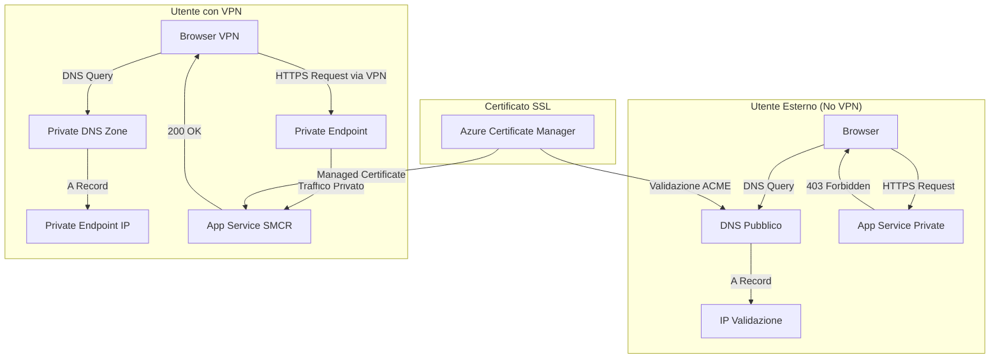
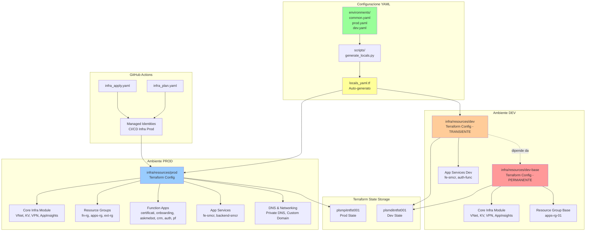

# 📋 Panoramica Infrastruttura PLSM Service Management

Questo documento fornisce una panoramica completa dell'infrastruttura Azure del progetto **PLSM Service Management**, inclusi gli ambienti Terraform, la struttura delle risorse, le convenzioni di naming e l'architettura di deployment.

---

## 🏗️ Panoramica Generale

L'infrastruttura del progetto **PLSM Service Management** è gestita tramite **Terraform** e ospitata su **Microsoft Azure** nella region **Italy North** (`italynorth`). L'infrastruttura supporta un'architettura multi-ambiente con ambiente di produzione (`prod`) e ambiente di sviluppo (`dev`), garantendo isolamento e sicurezza attraverso Virtual Network, Private Endpoint e accesso VPN.

### Caratteristiche Principali

- **Region Azure**: `italynorth` (Italy North)
- **Prefisso Risorse**: `plsm` (Platform Service Management)
- **Gestione IaC**: Terraform con moduli DX PagoPA
- **Sicurezza**: Accesso VPN-only per il portale SMCR
- **CI/CD**: GitHub Actions con identità managed
- **State Management**: Azure Blob Storage con autenticazione Azure AD

---

## 🗂️ Ambienti Terraform

Il progetto è organizzato in **tre ambienti Terraform** distinti, ognuno con il proprio stato (tfstate) e configurazione:

### 1. `prod` - Produzione

**Percorso**: `infra/resources/prod/`

**Backend State**:

- Storage Account: `plsmpitntfst001`
- Container: `terraform-state`
- Key: `plsm-service-management.prod.resources.tfstate`

**Caratteristiche**:

- Ambiente di **produzione** con tutte le risorse applicative
- Include infrastruttura core (VNet, Key Vault, VPN) e risorse applicative (Function App, App Services)
- Deployment automatico su push al branch `main` o manualmente tramite workflow `infra_apply.yaml`
- `env_short`: `p` (per naming convention)

### 2. `dev` - Sviluppo Transiente

**Percorso**: `infra/resources/dev/`

**Backend State**:

- Storage Account: `plsmditntfst001`
- Container: `terraform-state`
- Key: `plsm-service-management.dev.resources.tfstate`

**Caratteristiche**:

- Ambiente di **sviluppo** con risorse **transienti** (possono essere distrutte e ricreate)
- Contiene solo le risorse applicative necessarie per il testing
- **Dipende da `dev-base`** per infrastruttura core (VNet, Key Vault)
- `env_short`: `d` (per naming convention)

### 3. `dev-base` - Infrastruttura Base Sviluppo (Permanente)

**Percorso**: `infra/resources/dev-base/`

**Backend State**:

- Storage Account: `plsmditntfst001`
- Container: `terraform-state`
- Key: `plsm-service-management.dev.base.tfstate`

**Caratteristiche**:

- Infrastruttura **permanente** di base per l'ambiente di sviluppo
- Include: VNet, Key Vault, Application Insights, Resource Groups base
- **⚠️ NON VA MAI DISTRUTTO** - fornisce l'infrastruttura condivisa su cui si appoggiano le risorse transienti di `dev`
- Permette di risparmiare sui costi distruggendo solo le risorse applicative (`dev`) senza perdere la configurazione di rete e sicurezza

---

## 📁 Struttura Cartelle

```
infra/
├── bootstrapper/          # Script per inizializzazione identità e permessi
├── docs/                  # Documentazione infrastrutturale (architetture, scelte tecniche)
│   └── architecture/      # Documenti architetturali (es. VPN-only access)
├── repository/            # Configurazione Terraform per repository GitHub
├── resources/             # Configurazione Terraform delle risorse Azure
│   ├── _modules/          # Moduli Terraform riutilizzabili custom
│   ├── dev-base/          # Ambiente base sviluppo (permanente)
│   ├── dev/               # Ambiente sviluppo (transiente)
│   ├── prod/              # Ambiente produzione
│   └── environments/      # File YAML con configurazioni applicative
│       ├── common.yaml    # Configurazione condivisa tra ambienti
│       ├── dev.yaml       # Configurazione specifica per dev
│       └── prod.yaml      # Configurazione specifica per prod
├── scripts/               # Script di supporto (es. generate_locals.py)
├── GUIDA.md              # Guida alla gestione configurazione YAML
└── readme.md             # Introduzione infrastruttura
```

---

## 🔐 Backend Terraform

Lo **stato di Terraform** è archiviato in Azure Blob Storage con autenticazione Azure AD (senza chiavi di accesso condivise).

### Produzione

- **Storage Account**: `plsmpitntfst001`
- **Resource Group**: `terraform-state-rg`
- **Container**: `terraform-state`
- **Autenticazione**: Azure AD (`use_azuread_auth = true`)

### Sviluppo (dev e dev-base)

- **Storage Account**: `plsmditntfst001`
- **Resource Group**: `terraform-state-rg`
- **Container**: `terraform-state`
- **Autenticazione**: Azure AD (`use_azuread_auth = true`)

### Configurazione Backend

```hcl
terraform {
  backend "azurerm" {
    resource_group_name  = "terraform-state-rg"
    storage_account_name = "plsmpitntfst001"  # o "plsmditntfst001" per dev
    container_name       = "terraform-state"
    key                  = "plsm-service-management.prod.resources.tfstate"
    use_azuread_auth     = true
  }
}
```

---

## 🔧 Provider Terraform

Il progetto utilizza i seguenti provider Terraform:

### azurerm (~>4)

Provider principale per la gestione delle risorse Azure.

```hcl
azurerm = {
  source  = "hashicorp/azurerm"
  version = "~>4"
}
```

**Configurazione**:

```hcl
provider "azurerm" {
  storage_use_azuread = true
  features {}
}
```

### azuread (~>3)

Provider per la gestione di Azure Active Directory (gruppi, service principal, etc.).

```hcl
azuread = {
  source  = "hashicorp/azuread"
  version = "~> 3.0"
}
```

### azapi (~>2)

Provider per utilizzare funzionalità Azure non ancora supportate dai provider standard.

```hcl
azapi = {
  source  = "azure/azapi"
  version = "~> 2.0"
}
```

### pagopa-dx/azure (DX PagoPA)

Provider custom di PagoPA per moduli infrastrutturali standardizzati.

```hcl
dx = {
  source  = "pagopa-dx/azure"
  version = ">= 0.0.6, < 1.0.0"
}
```

---

## 🏷️ Naming Convention Azure

Tutte le risorse Azure seguono una **naming convention standardizzata** per garantire consistenza e tracciabilità.

### Pattern Generale

```
plsm-{env_short}-itn-{resource_type}-{name}-{instance}
```

### Componenti

- **`plsm`**: Prefisso del progetto (Platform Service Management)
- **`{env_short}`**: Ambiente breve
  - `p` = produzione
  - `d` = sviluppo
- **`itn`**: Region (`italynorth`)
- **`{resource_type}`**: Tipo di risorsa (rg, fn, app, kv, vnet, etc.)
- **`{name}`**: Nome descrittivo della risorsa
- **`{instance}`**: Numero di istanza (es. `01`, `02`)

### Esempi

| Risorsa                  | Nome Produzione             | Nome Dev                    |
| ------------------------ | --------------------------- | --------------------------- |
| Resource Group Functions | `plsm-p-itn-fn-rg-01`       | `plsm-d-itn-fn-rg-01`       |
| Resource Group Apps      | `plsm-p-itn-apps-rg-01`     | `plsm-d-itn-apps-rg-01`     |
| Key Vault                | `plsm-p-itn-common-kv-01`   | `plsm-d-itn-common-kv-01`   |
| VNet                     | `plsm-p-itn-common-vnet-01` | `plsm-d-itn-common-vnet-01` |
| Function App Certificati | `plsm-p-itn-cert-func-01`   | `plsm-d-itn-cert-func-01`   |
| App Service FE SMCR      | `plsm-p-itn-fe-smcr-app-01` | `plsm-d-itn-fe-smcr-app-01` |
| Application Insights     | `plsm-p-itn-common-appi-01` | `plsm-d-itn-common-appi-01` |

---

## 📦 Resource Groups Principali

### Produzione

| Resource Group            | Scopo               | Risorse Contenute                                                                                         |
| ------------------------- | ------------------- | --------------------------------------------------------------------------------------------------------- |
| `plsm-p-itn-fn-rg-01`     | Function Apps       | Tutte le Azure Function del progetto (certificati, onboarding, askmebot, CRM, auth, portale fatturazione) |
| `plsm-p-itn-apps-rg-01`   | App Services        | App Service per frontend (FE SMCR) e backend                                                              |
| `plsm-p-itn-ext-rg-01`    | Risorse esterne     | Risorse condivise o integrazioni esterne                                                                  |
| `plsm-p-itn-common-rg-01` | Core Infrastructure | VNet, Key Vault, Application Insights, DNS Zone (gestito da modulo DX)                                    |

### Sviluppo

| Resource Group            | Scopo                                                                |
| ------------------------- | -------------------------------------------------------------------- |
| `plsm-d-itn-apps-rg-01`   | App Services e Function per testing (creato in dev-base, permanente) |
| `plsm-d-itn-common-rg-01` | Core Infrastructure (gestito da modulo DX in dev-base)               |

---

## 🔑 Identità Managed per GitHub Actions

Il progetto utilizza **User Assigned Managed Identity** per autenticare le GitHub Actions con Azure, seguendo il principio di **workload identity federation** (senza segreti o certificati).

### Identità Produzione

Tutte create nel Resource Group: **`plsm-p-itn-sm-rg-01`**

| Nome Identità                         | Scopo                             | Utilizzata da                  |
| ------------------------------------- | --------------------------------- | ------------------------------ |
| `plsm-p-itn-sm-app-github-ci-id-01`   | CI/CD applicazioni - Build e Test | Workflow CI delle applicazioni |
| `plsm-p-itn-sm-app-github-cd-id-01`   | CI/CD applicazioni - Deployment   | Workflow CD delle applicazioni |
| `plsm-p-itn-sm-infra-github-ci-id-01` | CI/CD infrastruttura - Plan       | Workflow `infra_plan.yaml`     |
| `plsm-p-itn-sm-infra-github-cd-id-01` | CI/CD infrastruttura - Apply      | Workflow `infra_apply.yaml`    |

### Permessi Assegnati

Le identità hanno permessi specifici:

- **Contributor** sui Resource Group delle applicazioni
- **Key Vault Secrets Officer** sul Key Vault comune
- **Website Contributor** sulle Function App (per certificati)

---

## 🔒 Accesso VPN-Only: SMCR

Il portale **SMCR** (`smcr.pagopa.it`) è configurato per essere accessibile **solo tramite VPN PagoPA**, garantendo massima sicurezza per l'accesso interno.

### Architettura



### Componenti Chiave

1. **DNS Pubblico** (`smcr.pagopa.it`):
   - Mantiene delegazione NS
   - Contiene A record per validazione certificato ACME
   - **Non instrada traffico** utente

2. **Private DNS Zone** (`smcr.pagopa.it`):
   - Collegata alla VNet comune
   - A record punta al Private Endpoint
   - Risoluzione interna per utenti VPN

3. **App Service**:
   - Custom hostname binding: `smcr.pagopa.it`
   - Certificato managed di Azure
   - `public_network_access_enabled = false`

4. **Private Endpoint**:
   - Connessione privata all'App Service
   - Subnet: PEP (Private Endpoint) nella VNet comune

### Flusso Traffico

- **Con VPN**: DNS privato → Private Endpoint IP → App Service (✅ accesso consentito)
- **Senza VPN**: DNS pubblico → IP validazione → App Service privato (❌ 403 Forbidden)

**Documentazione completa**: `infra/docs/architecture/smcr-vpn-only-access.md`

---

## 🧩 Moduli DX PagoPA

Il progetto utilizza il modulo standardizzato **`pagopa-dx/azure-core-infra`** per creare l'infrastruttura core in modo consistente.

### Modulo: azure-core-infra

**Versione**: `2.2.1`

**Fonte**:

```hcl
module "azure_core_infra" {
  source  = "pagopa-dx/azure-core-infra/azurerm"
  version = "2.2.1"

  environment = merge(local.environment, {
    app_name        = "smcr"
    instance_number = "01"
  })

  nat_enabled  = false
  vpn_enabled  = true
  test_enabled = false

  tags = local.tags
}
```

### Risorse Create dal Modulo

- **VNet**: Virtual Network con subnet configurate
- **Key Vault**: Per gestione segreti centralizzata
- **Application Insights**: Monitoraggio e telemetria
- **VPN Gateway**: Accesso sicuro alla rete privata
- **Private DNS Zones**: Per risoluzione DNS interna
- **Resource Groups**: Common e Network

### Output Utilizzabili

- `common_key_vault`: Key Vault comune per segreti
- `common_resource_group_name`: Nome del Resource Group comune
- `network_resource_group_name`: Nome del Resource Group per risorse di rete
- `vnet_id`: ID della Virtual Network

---

## ⚙️ Configurazione Applicazioni (YAML-based)

Le **application settings** di tutte le Function App e App Services sono gestite tramite **file YAML** anziché essere hardcoded in Terraform.

### File YAML

| File                                       | Scopo                                           |
| ------------------------------------------ | ----------------------------------------------- |
| `infra/resources/environments/common.yaml` | Configurazione condivisa tra tutti gli ambienti |
| `infra/resources/environments/prod.yaml`   | Configurazione specifica per produzione         |
| `infra/resources/environments/dev.yaml`    | Configurazione specifica per sviluppo           |

### Vantaggi

- **Single source of truth** per configurazioni
- Facile aggiunta/modifica di variabili senza modificare Terraform
- Separazione netta tra codice infra e dati di configurazione
- Self-service per colleghi: edit YAML + PR

### Workflow

1. Modifica file YAML (`common.yaml` o `prod.yaml`)
2. Esegui script generatore: `python3 infra/scripts/generate_locals.py`
3. Verifica file autogenerato: `infra/resources/prod/locals_yaml.tf`
4. Commit di entrambi i file (YAML + `locals_yaml.tf`)

### Esempio Configurazione

```yaml
# prod.yaml
fe_smcr:
  __local: yaml_fe_smcr
  NODE_ENV: "production"
  WEBSITE_RUN_FROM_PACKAGE: "1"
  DB_HOST: "kv:db_host" # Segreto da Key Vault
  production:
    DEBUG: "false"
  staging:
    DEBUG: "true"
```

**Guida completa**: `infra/GUIDA.md`

---

## 🌍 Region Azure

Tutte le risorse sono deployate nella region **Italy North**.

**Codice Region**: `italynorth`

**Località fisica**: Milano, Italia

---

## 📊 Diagramma Architettura Ambienti



### Legenda Colori

- 🔴 **Rosso** (`dev-base`): Infrastruttura permanente - non distruggere
- 🟠 **Arancione** (`dev`): Risorse transienti - possono essere distrutte e ricreate
- 🔵 **Blu** (`prod`): Produzione - sempre attivo
- 🟢 **Verde** (YAML): Configurazione dati
- 🟡 **Giallo**: File auto-generati

---

## 🚀 Deployment e CI/CD

### Workflow GitHub Actions

| Workflow        | File                                 | Trigger                                  | Scopo                                              |
| --------------- | ------------------------------------ | ---------------------------------------- | -------------------------------------------------- |
| **Infra Plan**  | `.github/workflows/infra_plan.yaml`  | Pull Request su `infra/**`               | Verifica modifiche infrastruttura (terraform plan) |
| **Infra Apply** | `.github/workflows/infra_apply.yaml` | Push su `main` branch o workflow manuale | Applica modifiche infrastruttura (terraform apply) |

### Permessi Branch

Solo i seguenti branch possono eseguire `terraform apply`:

- `main` (deployment automatico)
- `infra/*` (deployment manuale tramite workflow_dispatch)

### Ambienti Disponibili

I workflow supportano i seguenti ambienti target:

- `prod` (default)
- `dev`
- `dev-base`

---

## 📚 Risorse Utili

- **Documentazione Architettura**: `infra/docs/architecture/`
- **Guida Configurazione YAML**: `infra/GUIDA.md`
- **Moduli Terraform Custom**: `infra/resources/_modules/`
- **Script di Supporto**: `infra/scripts/`

---

## ⚠️ Note Importanti

1. **Non distruggere mai `dev-base`**: contiene l'infrastruttura permanente di sviluppo (VNet, Key Vault)
2. **Modifica solo i file YAML**: le app settings sono gestite tramite YAML + script generatore
3. **Commit YAML + locals_yaml.tf insieme**: mantieni sincronizzati i file di configurazione
4. **Usa le Managed Identity**: no segreti hardcoded nei workflow GitHub
5. **Segui la naming convention**: garantisce consistenza e tracciabilità delle risorse

---

## 🆘 Supporto

Per domande o problemi sull'infrastruttura:

- Consulta la documentazione in `infra/docs/`
- Leggi la guida YAML in `infra/GUIDA.md`
- Contatta il team Service Management di PagoPA
