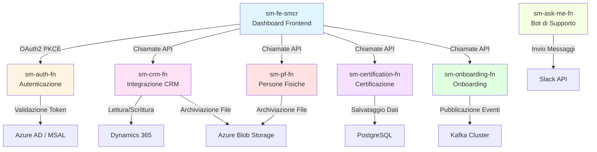

# PLSM Service Management - Panoramica del Monorepo

## 📋 Introduzione

**PLSM Service Management** è un monorepo che raccoglie tutti i microservizi, le applicazioni frontend e le librerie condivise della piattaforma PagoPA Service Management. Costruito con Turborepo e gestito tramite Yarn workspaces, il repository offre un'esperienza di sviluppo unificata che copre diverse Azure Functions, un frontend Next.js e configurazioni condivise.

La piattaforma gestisce operazioni critiche tra cui:

- Dashboard della Service Manager Control Room (SMCR)
- Flussi di autenticazione e autorizzazione
- Integrazione CRM con Dynamics 365
- Onboarding e certificazione dei contratti
- Integrazione con chatbot di supporto

---

## 🏗️ Struttura del Repository

```
plsm-service-management/
│
├── apps/                           # Applicazioni del monorepo
│   ├── sm-fe-smcr/                # 🎨 Frontend - Service Manager Control Room (Next.js 15 + React 19)
│   ├── sm-auth-fn/                # 🔐 Function - Autenticazione (MSAL/OAuth2 PKCE)
│   ├── sm-ask-me-fn/              # 🤖 Function - Bot "Ask Me Anything" (integrazione Slack)
│   ├── sm-be-smcr/                # 🔧 Backend - SMCR (in sviluppo)
│   ├── sm-certification-fn/       # 📜 Function - Certificazione XML (PostgreSQL)
│   ├── sm-crm-fn/                 # 📞 Function - Integrazione CRM (Dynamics 365)
│   ├── sm-onboarding-fn/          # 📋 Function - Onboarding contratti (Kafka/Avro)
│   └── sm-pf-fn/                  # 👤 Function - Gestione Persone Fisiche
│
├── packages/                       # Pacchetti condivisi
│   ├── eslint-config/             # Configurazioni ESLint condivise
│   ├── typescript-config/         # Configurazioni TypeScript condivise
│   └── ui/                        # Libreria di componenti UI condivisa (in sviluppo)
│
├── infra/                         # Infrastruttura come codice (Terraform)
├── docs/                          # Documentazione
│
├── turbo.json                     # Configurazione Turborepo
├── package.json                   # Configurazione root del package
└── yarn.lock                      # Yarn lock file
```

---

## 📦 Panoramica delle Applicazioni

| Applicazione            | Tipo           | Scopo                                                                                              | Tecnologie principali                                                        | Documentazione                            |
| ----------------------- | -------------- | -------------------------------------------------------------------------------------------------- | ---------------------------------------------------------------------------- | ----------------------------------------- |
| **sm-fe-smcr**          | Frontend       | Dashboard principale della Service Manager Control Room per la gestione dei servizi e le analytics | Next.js 15, React 19, TailwindCSS 4, Radix UI, MSAL, Zustand, TanStack Table | [Dettagli](./apps/sm-fe-smcr.md)          |
| **sm-auth-fn**          | Azure Function | Servizio di autenticazione con flusso MSAL OAuth2 PKCE e gestione token JWT                        | MSAL Node, JWT, Azure Functions v4                                           | [Dettagli](./apps/sm-auth-fn.md)          |
| **sm-ask-me-fn**        | Azure Function | Chatbot "Ask Me Anything" con integrazione Slack e notifiche email                                 | Slack Bolt, nodemailer, Azure Functions v4, Zod                              | Documentazione WIP                        |
| **sm-certification-fn** | Azure Function | Elaborazione certificazione XML con archiviazione su PostgreSQL                                    | fast-xml-parser, PostgreSQL (pg), Azure Functions v4                         | Documentazione WIP                        |
| **sm-crm-fn**           | Azure Function | Integrazione con Dynamics 365 CRM per la gestione delle relazioni con i clienti                    | Azure Identity, Azure Storage Blob, Azure Functions v4                       | Documentazione WIP                        |
| **sm-onboarding-fn**    | Azure Function | Flusso di onboarding contratti con event streaming Kafka e serializzazione Avro                    | Kafka, Avro, fp-ts, io-ts, Azure Functions v3                                | Documentazione WIP                        |
| **sm-pf-fn**            | Azure Function | Gestione dati delle Persone Fisiche con archiviazione sicura                                       | Azure Identity, Azure Storage Blob, Azure Functions v4                       | Documentazione WIP                        |
| **sm-be-smcr**          | Backend        | API backend per SMCR (in sviluppo)                                                                 | -                                                                            | -                                         |

---

## 🔄 Pipeline Turborepo

Turborepo orchestra le operazioni di build, test e sviluppo su tutte le applicazioni e i pacchetti. La configurazione della pipeline è definita in `turbo.json`.

### Configurazione dei Task

```json
{
  "tasks": {
    "build": {
      "outputs": ["dist/**", ".next/**"],
      "dependsOn": ["^build"]
    },
    "lint": {
      "dependsOn": ["^lint"]
    },
    "test": {
      "dependsOn": ["^build"],
      "outputs": []
    },
    "check-types": {
      "dependsOn": ["^check-types"]
    },
    "dev": {
      "cache": false,
      "persistent": true
    }
  }
}
```

### Ordine di Esecuzione dei Task

- **`build`** — Esegue il build in ordine topologico (prima le dipendenze). Gli output sono cachati in `.turbo/`.
- **`lint`** — Esegue ESLint su tutti i workspace. Dipende dal completamento del lint dei pacchetti dipendenti.
- **`test`** — Lancia i test dopo che tutte le dipendenze sono state compilate.
- **`check-types`** — Esegue il type checking TypeScript in ordine di dipendenza.
- **`dev`** — Avvia i server di sviluppo. Non è cachato perché opera in modalità watch.

### Strategia di Caching

Turborepo calcola la cache degli output dei task in base a:

- Hash dei file sorgente
- Variabili d'ambiente
- Configurazione dei task
- Grafo delle dipendenze

Questo riduce drasticamente i tempi nelle pipeline CI/CD e nello sviluppo locale, evitando di ripetere operazioni già eseguite.

### Script Root

Per eseguire task sull'intero monorepo dalla root:

```bash
yarn build          # Compila tutte le app e i pacchetti
yarn dev            # Avvia tutti i server di sviluppo
yarn lint           # Esegue il linting su tutti i workspace
yarn check-types    # Verifica i tipi TypeScript su tutti i workspace
yarn format         # Formatta il codice con Prettier
```

---

## 📚 Pacchetti Condivisi

### `@repo/eslint-config`

Fornisce configurazioni ESLint riutilizzabili per garantire una qualità del codice uniforme in tutto il monorepo.

**Configurazioni disponibili:**

- `base.js` — Regole ESLint di base per tutti i progetti
- `next.js` — Regole specifiche per Next.js (estende base)
- `react-internal.js` — Regole per librerie React (estende base)

**Esempio di utilizzo:**

```js
// apps/sm-fe-smcr/eslint.config.js
import baseConfig from "@repo/eslint-config/next";

export default [...baseConfig];
```

### `@repo/typescript-config`

Fornisce configurazioni TypeScript riutilizzabili per impostazioni uniformi del compilatore.

**Configurazioni disponibili:**

- `base.json` — Configurazione TypeScript di base
- `nextjs.json` — Impostazioni specifiche per Next.js (estende base)
- `react-library.json` — Impostazioni per librerie React (estende base)

**Esempio di utilizzo:**

```json
// apps/sm-fe-smcr/tsconfig.json
{
  "extends": "@repo/typescript-config/nextjs.json",
  "compilerOptions": {
    "outDir": "dist"
  }
}
```

### `@repo/ui`

Libreria di componenti UI condivisa per un design coerente tra le applicazioni (in sviluppo).

Il pacchetto conterrà:

- Componenti React riutilizzabili
- Design token e temi
- Utility e hook condivisi

---

## 🏷️ Convenzione di Naming

Tutte le applicazioni seguono un pattern di naming consistente:

```
sm-{dominio}-{tipo}
```

**Componenti del pattern:**

- `sm` — Service Management (prefisso del progetto)
- `{dominio}` — Dominio funzionale (auth, crm, onboarding, certification, pf, ask-me, fe, be)
- `{tipo}` — Tipo di applicazione (`fn` = Azure Function, `fe` = Frontend, `be` = Backend)

**Esempi:**

- `sm-fe-smcr` — Service Management Frontend per la Service Manager Control Room
- `sm-auth-fn` — Service Management Azure Function di autenticazione
- `sm-crm-fn` — Service Management Azure Function per il CRM

Questa convenzione rende immediatamente chiaro lo scopo e il livello architetturale di ogni applicazione.

---

## 🔗 Dipendenze tra Applicazioni

Il seguente diagramma illustra come le applicazioni interagiscono all'interno del sistema:



**Interazioni principali:**

1. **Frontend (sm-fe-smcr)** funge da dashboard centrale, consumando le API di tutte le function di backend
2. **Autenticazione (sm-auth-fn)** protegge tutte le chiamate API tramite il flusso MSAL OAuth2 PKCE
3. **CRM (sm-crm-fn)** sincronizza i dati con Dynamics 365 e archivia gli allegati su Azure Blob
4. **Certificazione (sm-certification-fn)** analizza documenti XML e persiste i dati strutturati su PostgreSQL
5. **Onboarding (sm-onboarding-fn)** pubblica eventi di contratto su Kafka con validazione dello schema Avro
6. **Persone Fisiche (sm-pf-fn)** gestisce le informazioni sensibili degli utenti con archiviazione sicura su blob
7. **Ask Me Bot (sm-ask-me-fn)** opera in modo indipendente, rispondendo ai messaggi su Slack

---

## 🚀 Per Iniziare

Sei nuovo nel monorepo? Parti da qui:

1. **[Guida introduttiva](./getting-started.md)** — Istruzioni di setup e prerequisiti
2. **[Guide delle singole applicazioni](#guide-delle-singole-applicazioni)** — Documentazione dettagliata per ogni app

### Guide delle Singole Applicazioni

- [sm-fe-smcr — Applicazione Frontend](./apps/sm-fe-smcr.md)
- [sm-auth-fn — Servizio di Autenticazione](./apps/sm-auth-fn.md)
- [sm-ask-me-fn — Bot di Supporto](./apps/sm-ask-me-fn.md)
- [sm-certification-fn — Servizio di Certificazione](./apps/sm-certification-fn.md)
- [sm-crm-fn — Integrazione CRM](./apps/sm-crm-fn.md)
- [sm-onboarding-fn — Servizio di Onboarding](./apps/sm-onboarding-fn.md)
- [sm-pf-fn — Servizio Persone Fisiche](./apps/sm-pf-fn.md)
- [Pacchetti condivisi](./packages/shared-packages.md)

---

## 🛠️ Stack Tecnologico

### Infrastruttura del Monorepo

| Categoria                 | Tecnologia     | Versione    |
| ------------------------- | -------------- | ----------- |
| **Gestore dei pacchetti** | Yarn (Berry)   | 4.10.3      |
| **Orchestrazione build**  | Turborepo      | 2.5.8       |
| **Runtime**               | Node.js        | >=18        |
| **Linguaggio**            | TypeScript     | 5.x         |
| **Formattazione codice**  | Prettier       | ^3.6.x      |
| **Linting**               | ESLint         | 9.x         |
| **Testing (root)**        | Jest + ts-jest | 30.x / 29.x |

### Frontend — `sm-fe-smcr`

| Categoria                  | Tecnologia             | Versione   |
| -------------------------- | ---------------------- | ---------- |
| **Framework**              | Next.js                | ^15.3.6    |
| **UI Library**             | React                  | ^19.0.0    |
| **Stili**                  | TailwindCSS            | ^4.1.13    |
| **Componenti UI**          | Radix UI               | varie      |
| **Icone**                  | Lucide React           | ^0.544.0   |
| **State management**       | Zustand                | ^5.0.7     |
| **Form**                   | React Hook Form + Zod  | ^7.71 / ^4 |
| **Tabelle**                | TanStack Table         | ^8.21.3    |
| **Grafici**                | Recharts               | 2.15.4     |
| **Autenticazione**         | MSAL Browser + React   | ^4.13 / ^3 |
| **Date**                   | date-fns / dayjs       | ^4 / ^1.11 |
| **PDF**                    | react-pdf              | ^9.2.1     |
| **Database (server-side)** | Knex + PostgreSQL (pg) | ^3.1 / ^8  |
| **Logging**                | Pino                   | ^10.1.0    |
| **Email**                  | Nodemailer             | ^7.0.3     |
| **URL state**              | nuqs                   | ^2.8.5     |

### Azure Functions

| Applicazione            | Azure Functions | TypeScript | Dipendenze chiave                                          |
| ----------------------- | --------------- | ---------- | ---------------------------------------------------------- |
| **sm-auth-fn**          | v4 `^4.10.0`    | ^5.9.3     | `@azure/msal-node ^2`, `jsonwebtoken ^9`                   |
| **sm-ask-me-fn**        | v4 `^4.0.0`     | ^5.6.3     | `@slack/bolt ^3`, `nodemailer ^6`, `zod ^3`                |
| **sm-certification-fn** | v4 `^4.7.2`     | ^5.9.2     | `fast-xml-parser ^5`, `pg ^8`, `zod ^4`                    |
| **sm-crm-fn**           | v4 `^4.10.0`    | ^5.9.3     | `@azure/identity ^4`, `@azure/storage-blob ^12`, `zod ^4`  |
| **sm-onboarding-fn**    | v3 `^3.5.0`     | ^5.7.2     | `fp-ts ^2`, `io-ts ^2`, `avsc ^5`, `@pagopa/fp-ts-kafkajs` |
| **sm-pf-fn**            | v4 `^4.10.0`    | ^5.9.3     | `@azure/identity ^4`, `@azure/storage-blob ^12`, `zod ^4`  |

### Infrastruttura Cloud

| Categoria          | Tecnologia           | Note                                                        |
| ------------------ | -------------------- | ----------------------------------------------------------- |
| **Cloud Provider** | Microsoft Azure      | Functions, Blob Storage, Active Directory                   |
| **IaC**            | Terraform            | Nella cartella `infra/`                                     |
| **Autenticazione** | MSAL / OAuth2 PKCE   | Azure Active Directory                                      |
| **Messaggistica**  | Apache Kafka + Avro  | Usato da `sm-onboarding-fn`                                 |
| **Database**       | PostgreSQL           | Usato da `sm-certification-fn` e `sm-fe-smcr` (server-side) |
| **Storage**        | Azure Blob Storage   | Usato da `sm-crm-fn` e `sm-pf-fn`                           |
| **Monitoring**     | Application Insights | Integrato in `sm-ask-me-fn` e `sm-onboarding-fn`            |

---

## 📖 Risorse Aggiuntive

- **[Integrazione MSAL](../msal/)** — Configurazione di Microsoft Authentication Library
- **[Infrastruttura](../../infra/)** — Configurazioni Terraform per le risorse Azure

---

_Ultimo aggiornamento: Marzo 2026_
