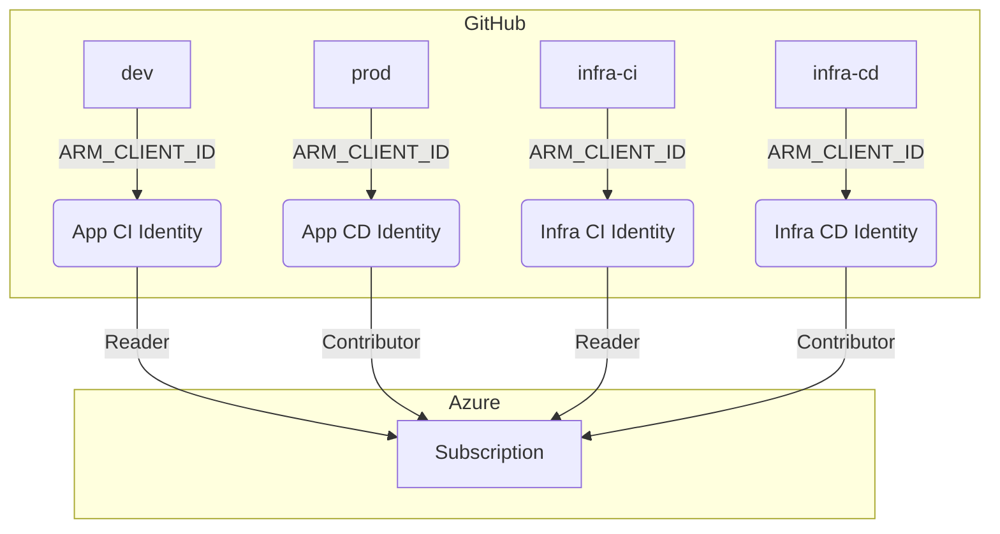

# Integrazione GitHub-Azure con Federated Identity

Questo progetto Terraform configura l'integrazione tra GitHub e Azure tramite **Federated Identity Credentials (OIDC)**, creando:

1. **Ambienti GitHub** per CI/CD
2. **Managed Identity in Azure** con ruoli RBAC specifici
3. **Secrets e variabili** per l'autenticazione

## 🌐 **Risorse Create su GitHub**

### 🔒 Repository-Level Secrets
| Secret Name | Tipo | Utilizzo |
|-------------|------|----------|
| `ARM_SUBSCRIPTION_ID` | Secret | Autenticazione Azure |
| `ARM_TENANT_ID` | Secret | Autenticazione Azure |

### 🏗️ GitHub Environments
| Environment | Tipo | Branch Policy | Variabili | Secrets |
|------------|------|---------------|-----------|---------|
| `dev` | App Dev | ❌ | `ARM_SUBSCRIPTION_ID` | `ARM_CLIENT_ID` |
| `prod` | App Prod | ✅ (protected) | `ARM_SUBSCRIPTION_ID` | `ARM_CLIENT_ID` |
| `infra-ci` | Infra CI | ❌ | `ARM_SUBSCRIPTION_ID` | `ARM_CLIENT_ID` |
| `infra-cd` | Infra CD | ✅ (protected) | `ARM_SUBSCRIPTION_ID` | `ARM_CLIENT_ID` |

## ☁️ **Risorse Create su Azure**

### 🔑 Managed Identities
| Identity Name | Tipo | Ruoli RBAC | Scope |
|--------------|------|------------|-------|
| `sm-p-itn-core-app-github-ci-id-01` | App CI | `Reader` (Subscription), `Storage Blob Data Contributor` (RG) | `/subscriptions/...` |
| `sm-p-itn-core-app-github-cd-id-01` | App CD | `Contributor` (Subscription), `Storage Blob Data Contributor` (RG) | `/subscriptions/...` |
| `sm-p-itn-core-infra-github-ci-id-01` | Infra CI | `Reader` (Subscription), `Storage Blob Data Contributor` (RG) | `/subscriptions/...` |
| `sm-p-itn-core-infra-github-cd-id-01` | Infra CD | `Contributor` (Subscription), `Storage Blob Data Contributor` (RG) | `/subscriptions/...` |

### 🔗 Federated Identity Credentials
| Nome | Identity Associata | Subject GitHub |
|------|--------------------|----------------|
| `plsm-service-management-environment-app-prod-ci` | App CI | `repo:pagopa/plsm-service-management:environment:app-prod-ci` |
| `plsm-service-management-environment-app-prod-cd` | App CD | `repo:pagopa/plsm-service-management:environment:app-prod-cd` |
| `plsm-service-management-environment-infra-prod-ci` | Infra CI | `repo:pagopa/plsm-service-management:environment:infra-prod-ci` |
| `plsm-service-management-environment-infra-prod-cd` | Infra CD | `repo:pagopa/plsm-service-management:environment:infra-prod-cd` |

## 🛠️ **Workflow di Esempio**

### CI Applicativa (dev)
```yaml
jobs:
  build:
    runs-on: ubuntu-latest
    environment: dev
    steps:
      - uses: azure/login@v1
        with:
          client-id: ${{ secrets.ARM_CLIENT_ID }}
          tenant-id: ${{ secrets.ARM_TENANT_ID }}
          subscription-id: ${{ vars.ARM_SUBSCRIPTION_ID }}
```

## 📊 Diagramma dei Permessi




🔄 Distruzione Risorse
Eseguendo terraform destroy verranno rimossi:

Tutti gli ambienti GitHub

I secrets e variabili

Le Managed Identity e ruoli RBAC in Azure

⚠️ Attenzione: Le risorse Azure esterne (es. Resource Group) non gestite da questo Terraform non verranno eliminate.